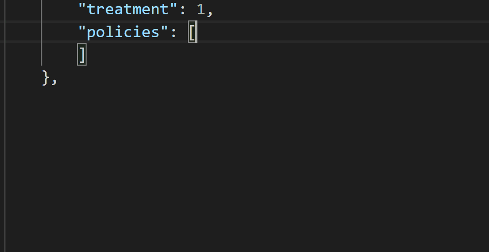

# Huorong HIPS Rule Schema

## Table of Contents

- [About](#about)
- [Usage](#usage)

## About 

The project includes two json schemas of Huorong Host-based Intrusion Prevention System (HIPS) custom rule files (json). They can be used to validate Huorong HIPS rules and speed up editing.

## Usage 

- **`rule_schema.json`** - schema for main rule json

- **`auto_schema.json`** - schema for verdict cache json

Use an editor to load schema and start your work.

[Json Schema Getting Started](https://json-schema.org/learn/)

[Visual Studio Code Config](https://code.visualstudio.com/docs/languages/json)

Example Usage: 

